

# Спутник Плутона -- ХАРОН

Предварительные каскады для Analog Devices ADALM-PLUTO SDR.

https://wiki.analog.com/university/tools/pluto

* Передняя панель управления и индикации
* Задняя панель с разъёмами
* Основная плата

## Панели v1.0.0

### Вид спереди / сзади

</img>
</img>

Исходные файлы для печатной платы:
* hw/front.svg
* hw/back.svg

Для получения KiCAD проекта используйте Inkscape + svg2shenzhen

https://github.com/badgeek/svg2shenzhen

Для получения GERBER файлов используйте KiCAD

Для надписей использован шрифт B612:

https://fonts.google.com/specimen/B612

### Перечень элементов

| Поз.  обозна-  чение | Наименование | Кол. | Примечание |
|-|-|-|-|
| D1 | VS1838B | 1 | |
| R1 | Переменный резистор 10К | 1 | |
| ИН1 | Индикатор 2" TFT ST7789V | 1 | |
| SB1 SB2 | Кнопка 6x6x5 | 2 | |
| Р1 - Р9 | SMA -> IPEX | 9 | |
| Р10 | DB9 | 1 | |

### Передняя панель

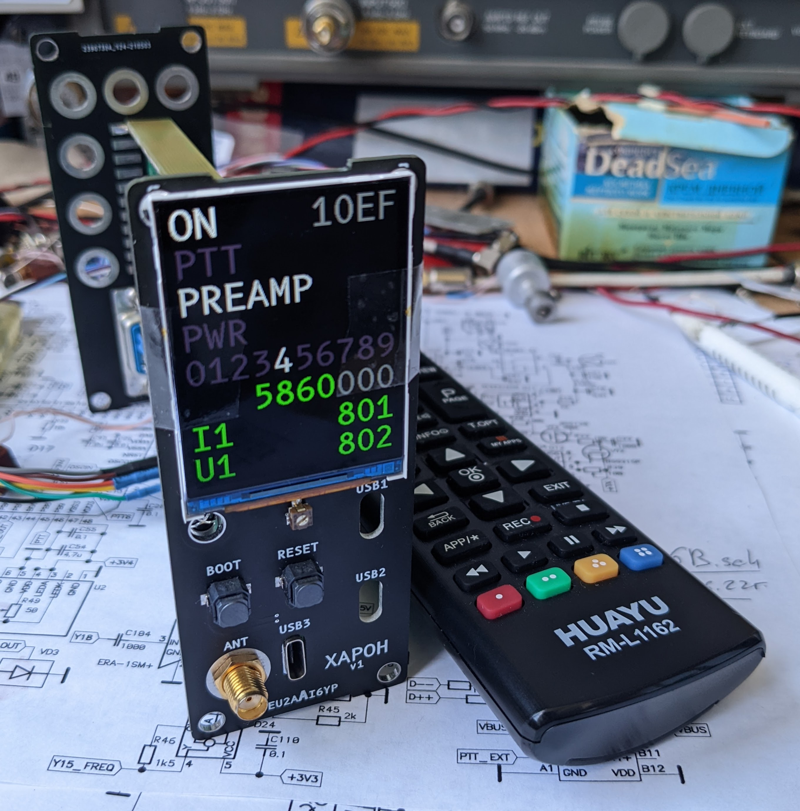</img>

### Вид спереди в корпусе

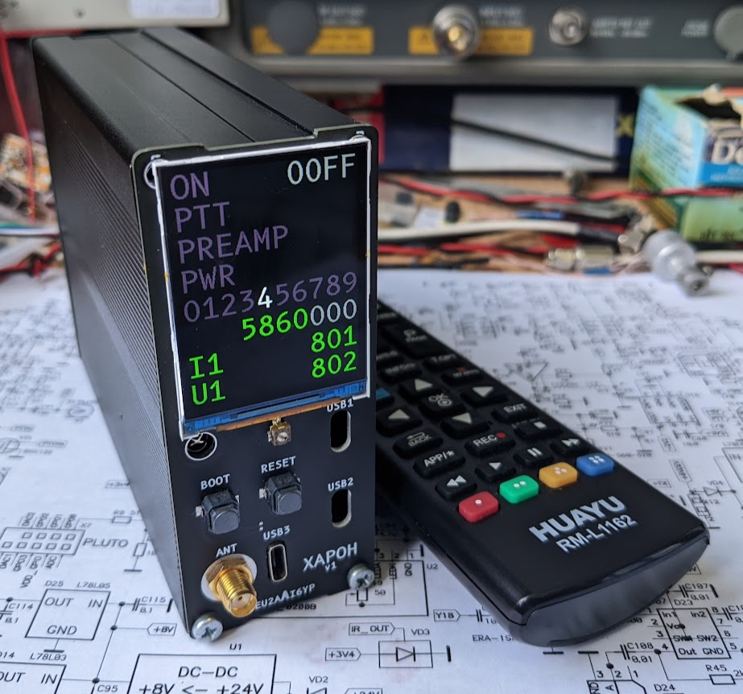</img>

### Задняя панель

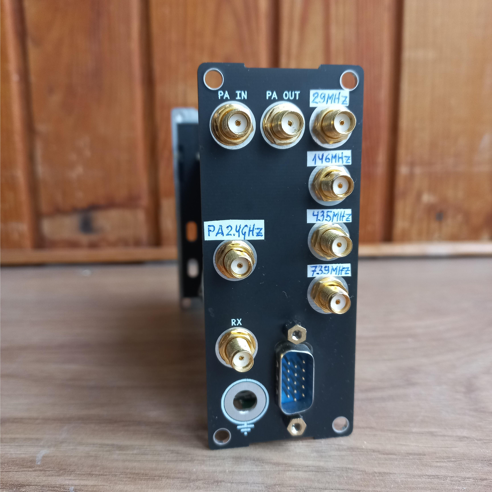</img>

## Основная плата v1.0.0

### Схема антенной секции

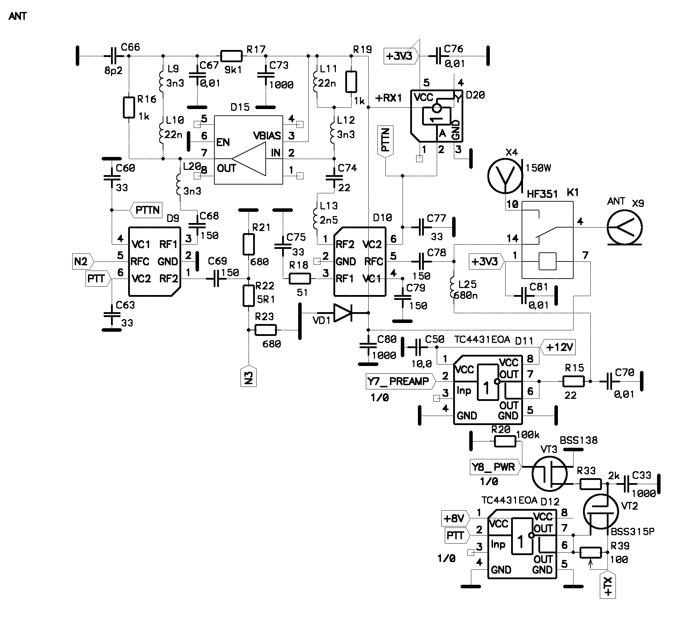</img>

### Схема процессорной секции

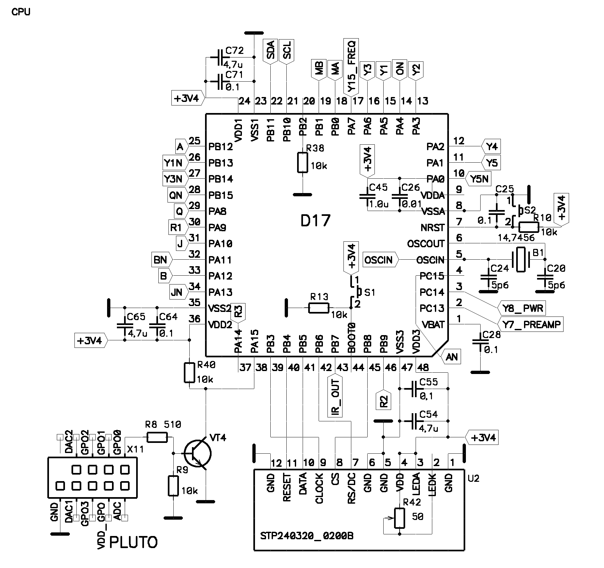</img>

### Схема секции источник питания

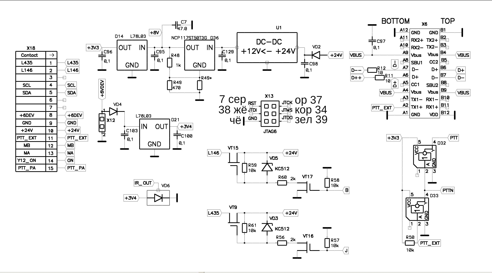</img>

### Схема секции фильтров

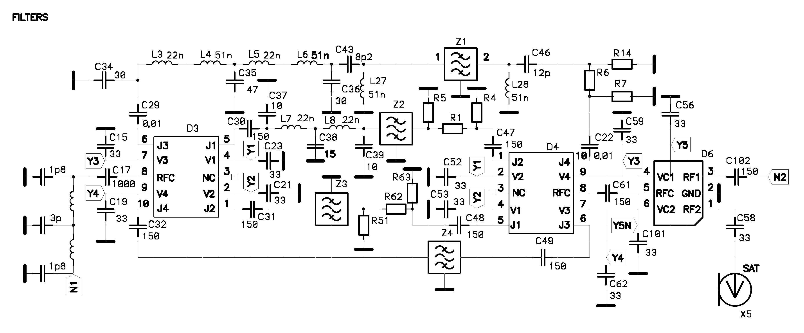</img>

### Схема секции усилителя

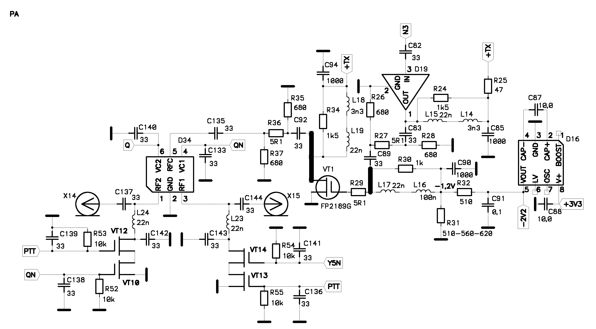</img>

### Схема секции приёмника

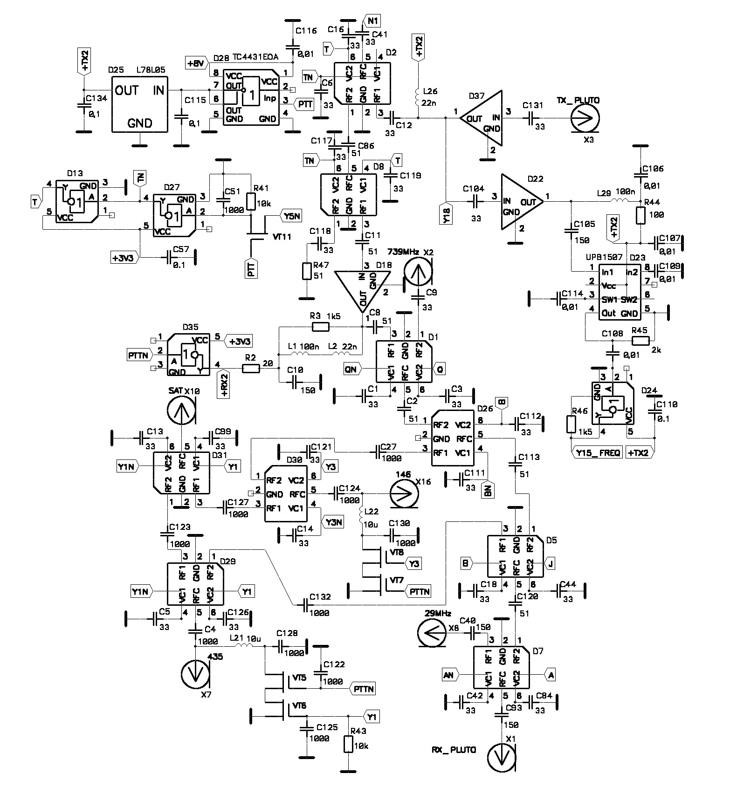</img>

### Топология платы лицевая сторона

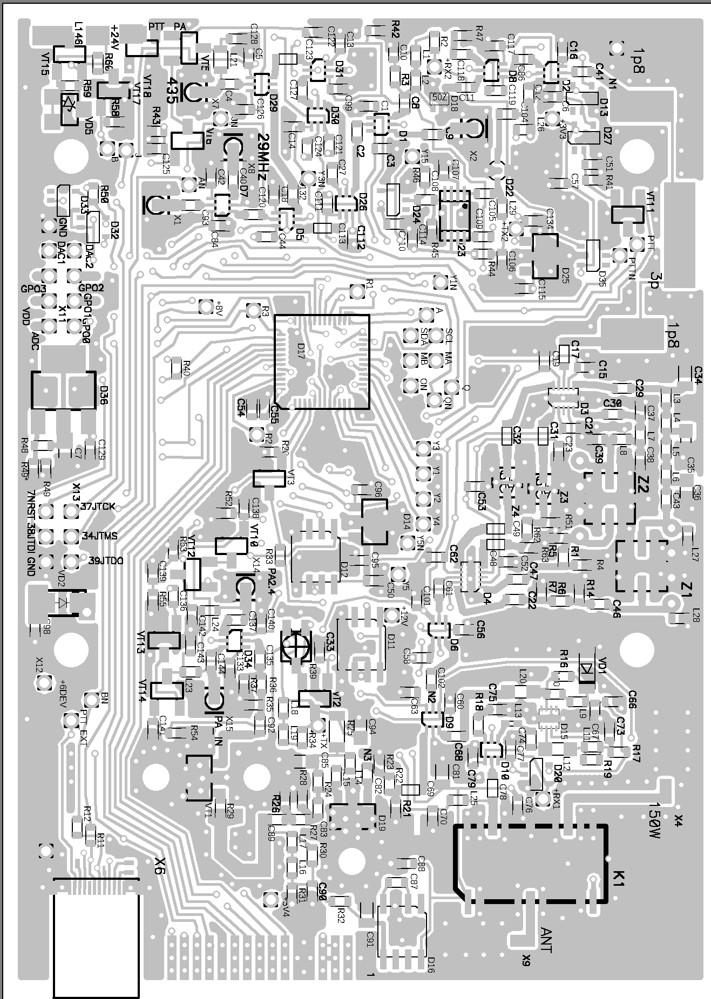</img>

### Топология платы обратная сторонв

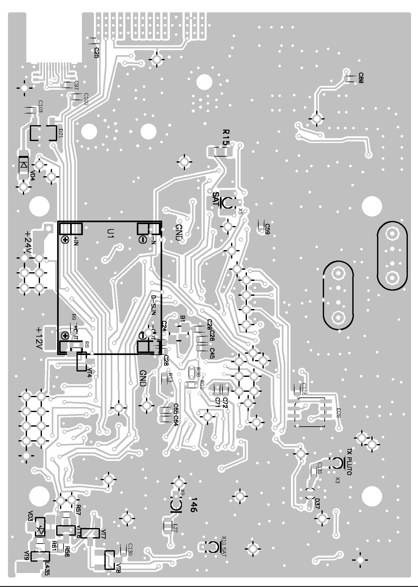</img>

## Корпус

</img>

## Индикатор

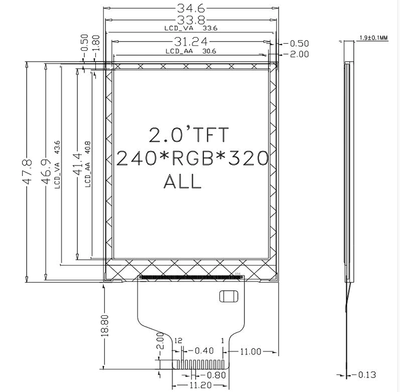</img>

## Фото устройства

</img>

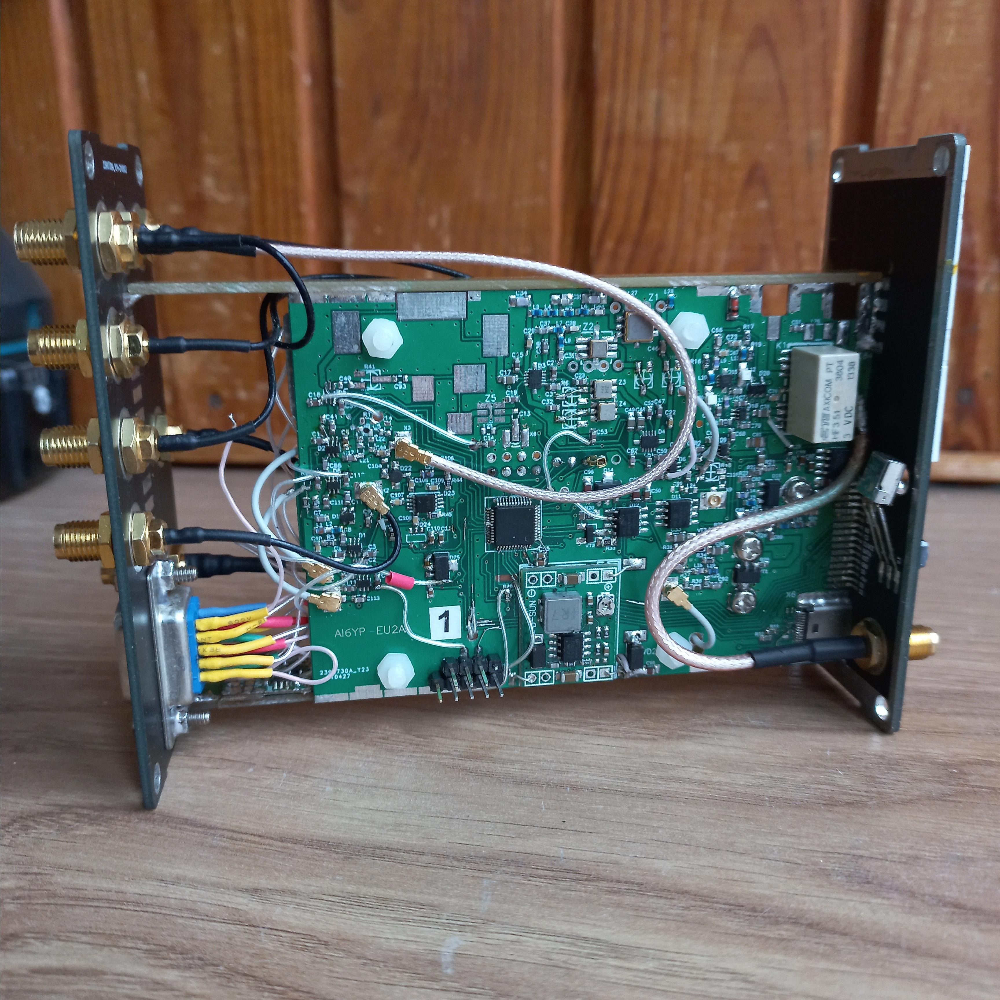</img>

</img>

## Преречень элементов

hw/8B_PE.doc

## License

Hardware is released under the [CC BY-SA 4.0](https://creativecommons.org/licenses/by-sa/4.0/) license.

Software is relesed under [MIT](LICENSE) license.

