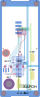
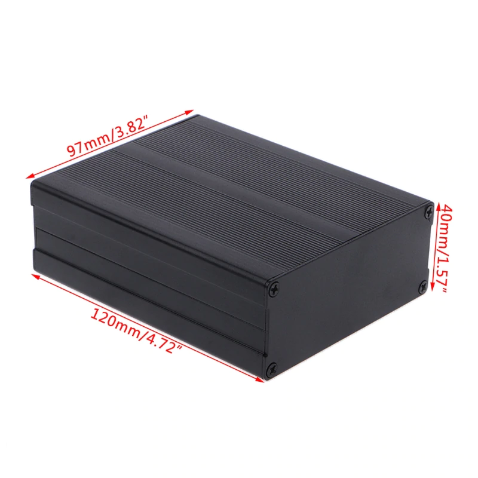
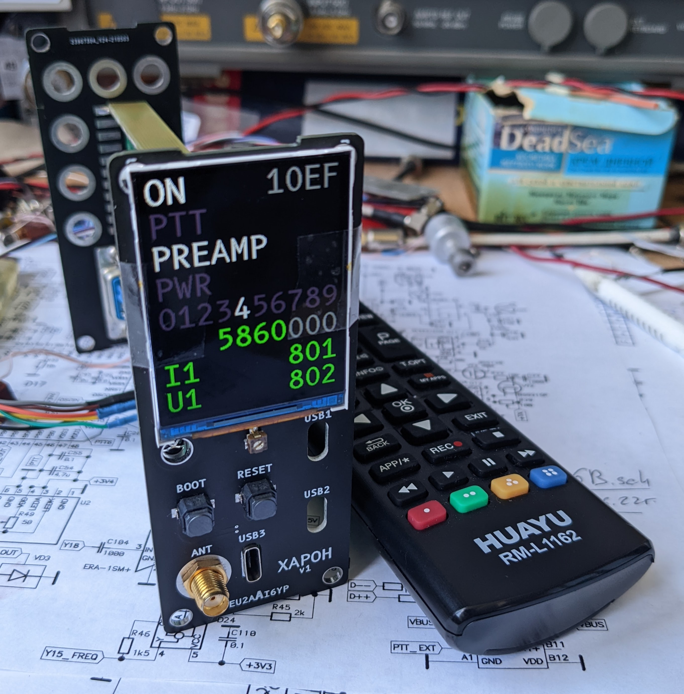

Спутник Плутона -- Харон.

# Панели v1.0.0

## Вид спереди / сзади

</img>
</img>

Исходные файлы для печатной платы:
* hw/front.svg
* hw/back.svg

Для получения KiCAD проекта используйте Inkscape + svg2shenzhen

https://github.com/badgeek/svg2shenzhen

Для получения GERBER файлов используйте KiCAD

Для надписей использован шрифт B612:

https://fonts.google.com/specimen/B612

## Корпус

</img>

## Фото устройства

</img>

## License

Hardware is released under the [CC BY-SA 4.0](https://creativecommons.org/licenses/by-sa/4.0/) license.

Software is relesed under [MIT](LICENSE) license.
